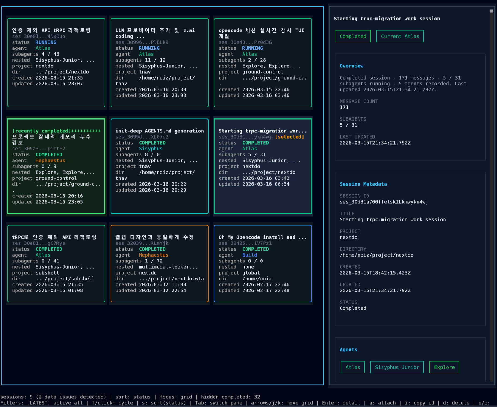

<p align="center">
  
</p>

# Ground Control

`gctrl` is a terminal TUI for monitoring OpenCode sessions in real time. It reads the local OpenCode SQLite database in read-only mode and presents session status, active agents, subagent activity, and recent updates in a card-based interface.

## Quick Start

Make sure these are available before running `gctrl`:

- Node.js 22.13.0 or later
- OpenCode installed and used on the same machine
- `~/.local/share/opencode/opencode.db` exists

### Run with `bunx`

```bash
bunx gctrl
```

`bunx` works by relaunching the CLI with Node under the hood.

### Run with `npx`

```bash
npx gctrl
```

<p align="center">
  
</p>

## Overview

- Displays OpenCode sessions in a live terminal list
- Refreshes automatically every 2 seconds
- Shows status, project label, session ID, and update time
- Supports attach, copy ID, delete, refresh, and keyboard navigation

## Usage

After launch, use these shortcuts to navigate and control the monitor:

| Key | Action |
| --- | --- |
| `j` / `k` / `Up` / `Down` | Move selection |
| `Enter` | Attach to selected session |
| `a` | Attach to the selected session |
| `i` | Copy the selected session ID |
| `d` | Request delete for selected session |
| `y` / `n` | Confirm or cancel delete prompt |
| `r` | Refresh immediately |
| `Esc` / `q` | Cancel prompt or quit |
| `Ctrl+C` | Quit immediately |

## Requirements

- Node.js 22.13.0+ is required for built-in `node:sqlite`.
- `bun` is optional and only used as an alternate launcher (`bunx gctrl`).
- The monitor reads session data from `~/.local/share/opencode/opencode.db`.
- Override the database path with `GCTRL_DB_PATH=/custom/path/opencode.db`.
- Attach and delete actions use the `opencode` CLI, so `opencode` should be available in your `PATH`.
- Non-interactive mode (missing TTY stdin/stdout) prints a tab-separated snapshot and exits.

## Local Development

```bash
bun install
bun run dev
```

Useful scripts:

```bash
bun run start
bun run dev
bun run build
bun run typecheck
bun run lint
bun run check
```

## Project Structure

```text
bin/          CLI wrapper
src/db/       OpenCode SQLite read-only access
src/ui/       TUI components
src/config/   color and agent configuration
src/lib/      status detection logic
dist/         compiled output
```

## License

MIT

---

<p align="center">
  <strong>Supervised by NoizBuster, Written by OpenCode</strong>
</p>
