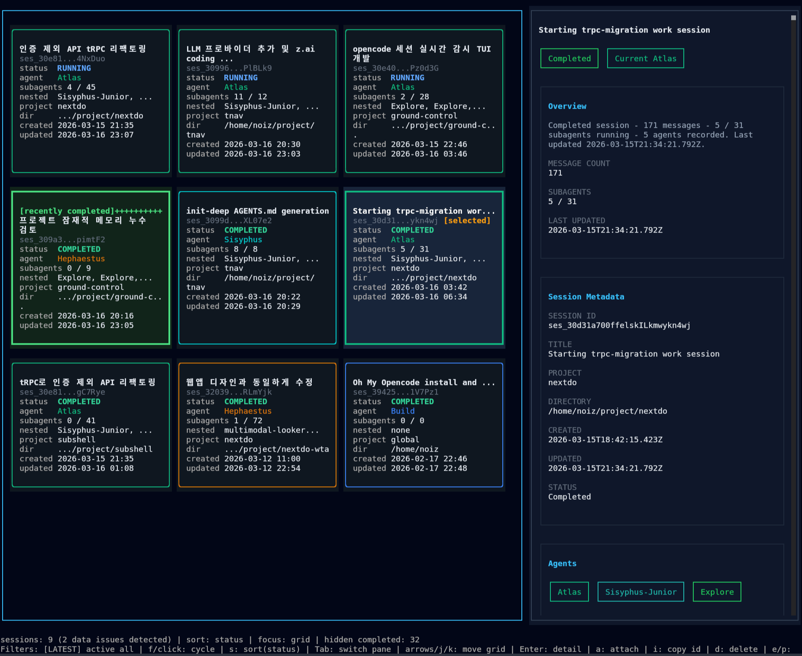
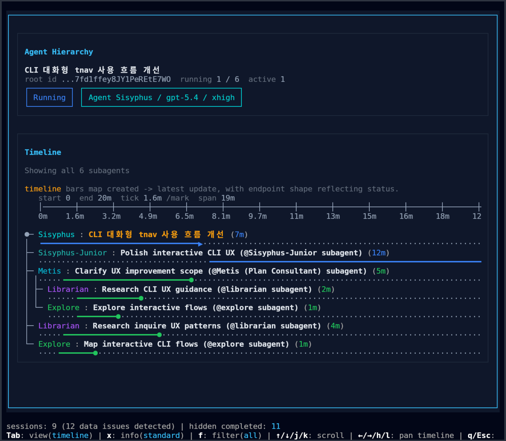

<p align="center">
  
</p>

# Ground Control

`gctrl` is a terminal TUI for monitoring OpenCode sessions in real time. It reads the local OpenCode SQLite database in read-only mode and presents session status, active agents, subagent activity, and recent updates in a card-based interface.

## Quick Start

Make sure these are available before running `gctrl`:

- Node.js 22.13.0 or later
- OpenCode installed and used on the same machine
- `~/.local/share/opencode/opencode.db` exists

### Run with `bunx`

```bash
bunx gctrl
```

`bunx` works by relaunching the CLI with Node under the hood.

### Run with `npx`

```bash
npx gctrl
```

<p align="center">
  
</p>

<p align="center">
  
</p>

## Overview

- Displays OpenCode sessions in a live terminal list
- Refreshes automatically every 2 seconds
- Shows status, project label, session ID, and update time
- Supports attach, copy ID, delete, refresh, and keyboard navigation

## Usage

After launch, use these shortcuts to navigate and control the monitor:

| Key | Action |
| --- | --- |
| `h` / `j` / `k` / `l` / `←` / `↑` / `↓` / `→` | Move selection in the session grid |
| `j` / `k` / `↑` / `↓` (detail focus) | Scroll session detail |
| `Tab` | Switch focus between grid and detail pane (when sideview is enabled) |
| `Enter` | Open the selected session detail view |
| `e` / `p` | Toggle sideview layout |
| `f` | Cycle session filter mode (`active → recent → busy → all`) |
| `s` | Cycle sort mode (`status → update → create`) |
| `c` | Open hierarchy view |
| `t` | Open hierarchy directly in timeline view |
| `a` | Attach to the selected session |
| `i` | Copy the selected session ID |
| `K` | Stop active child sessions (detail/sideview mode only) |
| `d` | Request delete for selected session |
| `y` / `n` | Confirm or cancel delete prompt |
| `r` | Refresh immediately |
| `Esc` / `q` | Cancel prompt, close current view, or quit from the main view |
| `Ctrl+C` | Quit immediately |

### Stop Child Sessions (`K`)

Available in detail or sideview mode. Press `K` (Shift+K) to gracefully stop all active (non-completed, non-failed) child sessions of the selected session.

The stop flow works in two stages:

1. **Graceful stop**: sends a "stop" message to each child session via `opencode run --session <id>`, which triggers normal completion (`finish: "stop"`).
2. **Delete fallback**: if graceful stop fails for any child, a per-item confirmation dialog appears where you can choose to delete (`y`), skip (`n`), or cancel all (`Esc`/`q`).

### Session Filter Modes (`f`)

- `active`: non-completed sessions, plus externally attached completed sessions. Directory-count fallback is applied as **non-complete first**, and only remaining slots can surface latest completed sessions.
- `recent`: everything visible in `active`, plus (1) the globally latest completed session and (2) each project's latest updated session.
- `busy`: non-completed sessions only.
- `all`: all sessions.

### Hierarchy View (`c`)

Press `c` on a selected session to open the agent hierarchy view, or press `t` to open it directly in timeline mode. This shows the session's subagent tree with status, timing, and metadata.

| Key | Action |
| --- | --- |
| `Tab` | Cycle view mode (tree / timeline) |
| `x` | Cycle info mode (standard / detailed) |
| `f` | Cycle filter mode (latest / busy / all) |
| `←` / `→` / `h` / `l` | Pan timeline (timeline mode only) |
| `j` / `k` / `Up` / `Down` | Scroll |
| `Esc` / `q` | Close hierarchy view |

## Requirements

- Node.js 22.13.0+ is required for built-in `node:sqlite`.
- `bun` is optional and only used as an alternate launcher (`bunx gctrl`).
- The monitor reads session data from `~/.local/share/opencode/opencode.db`.
- Override the database path with `GCTRL_DB_PATH=/custom/path/opencode.db`.
- Attach and delete actions use the `opencode` CLI, so `opencode` should be available in your `PATH`.
- Non-interactive mode (missing TTY stdin/stdout) prints a tab-separated snapshot and exits.

## Local Development

```bash
bun install
bun run dev
```

Useful scripts:

```bash
bun run start
bun run dev
bun run build
bun run typecheck
bun run lint
bun run check
```

## Project Structure

```text
bin/          CLI wrapper
src/db/       OpenCode SQLite read-only access
src/ui/       TUI components
src/config/   color and agent configuration
src/lib/      status detection logic
dist/         compiled output
```

## Session Status Detection

Session status is derived from the latest message in the OpenCode SQLite database. The detection pipeline reads the most recent `message` row per session, parses its JSON `data` column, and applies status detectors in priority order.

### Status Priority

| Priority | Status | Condition |
|---|---|---|
| 1 | `failed` | `finish === "error"` |
| 2 | `waiting` | Question tool is running AND no user response yet (see Waiting Detection below) |
| 3 | `completed` | `finish === "stop"` OR `time.completed` is a finite number |
| 4 | `running` | Not failed, not waiting, not completed |
| 5 | `unknown` | Message data is null, empty, or failed JSON parsing |

### Finish Values

The `finish` field on the latest message indicates how the session step ended:

| `finish` | `time.completed` | Detected Status | Display Label |
|---|---|---|---|
| `stop` | — | `completed` | Completed |
| `tool-calls` | absent | `running` | Running |
| `error` | — | `failed` | Failed |
| `other` | present | `completed` | Completed (other) |
| `length` | present | `completed` | Completed (length) |
| `unknown` | present | `completed` | Completed (unknown) |
| _undefined_ | absent | `running` | Running |
| _no message_ | — | `unknown` | Unknown |

When `finish` is `"other"`, `"length"`, or `"unknown"`, the status label appends the reason in parentheses — e.g. `Completed (other)`, `Completed (length)`.

### Waiting Detection

A session is `waiting` when the question tool is active and awaiting user input. This uses a secondary signal from the `part` table:

1. Find the latest `part` row with `type === "tool"` and `tool === "question"` where `state.status === "running"`
2. Compare its timestamp against the latest user message time
3. If the question tool time is newer → `waiting` (overrides `running`)

Waiting never overrides `failed` or `completed`.

### Display Override: AWAITING SUBAGENT

A `completed` root session that has running child sessions displays as **AWAITING SUBAGENT** instead of Completed. This reflects that the parent is technically done but work continues in subagents. The effective status becomes `running` for filtering and sorting purposes.

### Hierarchy Filter: Latest Mode

In the hierarchy view's "latest" filter mode, subagent sessions are filtered as follows:

- **Active** subagents (pending/running/waiting) are always shown
- **AWAITING SUBAGENT** subagents (completed with active children) are always shown
- **Terminal** subagents (completed/failed/unknown with no active children) — only the most recently updated one is shown

## License

MIT

---

<p align="center">
  <strong>Supervised by NoizBuster, Written by OpenCode</strong>
</p>
